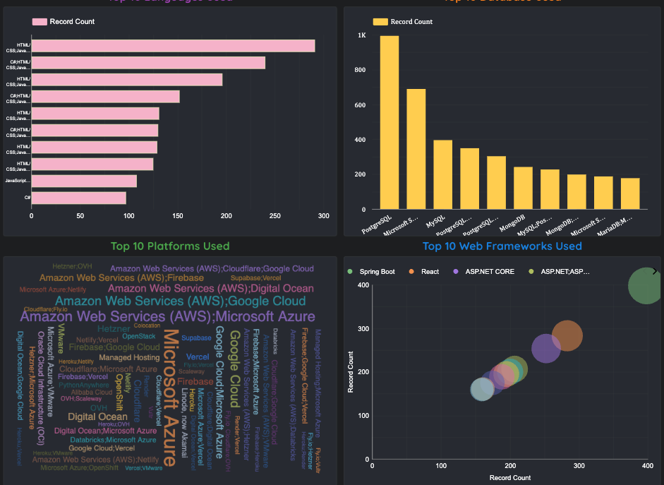
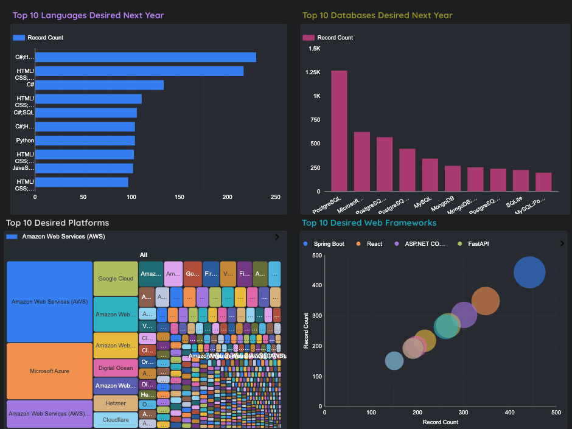
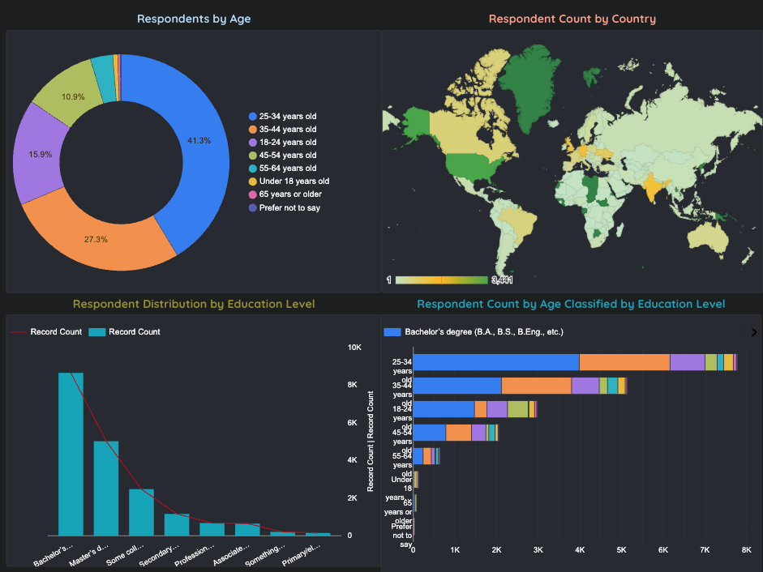

# 📊 IBM Data Analytics Capstone Project
### Emerging Technology Trends: Insights from Stack Overflow Developer Survey 2024

<div align="center">


**Dhruvina Gujarati** | March 2026

[🔗 Live Dashboard](https://lookerstudio.google.com/reporting/02c36551-3f1b-498d-8bab-8f938124ec4a) • [📁 View Repository](#) • [📄 Final Report](#)

</div>

---

## 🧠 Project Overview

As an Associate Data Analyst at a global IT consulting firm, I analyzed the **2024 Stack Overflow Developer Survey** to uncover current and future technology trends that drive strategic business decisions.

This end-to-end capstone project demonstrates the full data analytics lifecycle — from raw data collection to executive-level storytelling — using industry-standard tools including Python, SQL, Jupyter Notebook, and Google Looker Studio.

> **Business Problem:** *Which programming languages, databases, platforms, and frameworks should organizations prioritize for hiring, training, and technology investment in 2024 and beyond?*

---

## 🎯 Key Findings

| Category | Current Leader | Rising Trend |
|---|---|---|
| 💻 Programming Language | JavaScript (14,856 responses) | Rust & Go gaining momentum |
| 🗄️ Database | PostgreSQL (11,557 responses) | Supabase & Redis emerging |
| ☁️ Platform | Amazon Web Services (AWS) | Google Cloud growing fast |
| 🌐 Web Framework | React & Spring Boot | FastAPI rising |
| 👤 Demographics | 25–34 age group (41.3%) | Global developer diversity |

### 📌 Top Insights
- **JavaScript dominates** both current usage and future aspirations — full-stack development is the industry standard
- **PostgreSQL is the #1 database** for both current use and desired future adoption
- **AWS and Google Cloud** lead platform adoption, confirming the dominance of cloud infrastructure
- **Rust and Go** are the fastest-growing desired languages — early adoption signals a shift toward performance-first engineering
- **41.3% of developers are aged 25–34**, highly educated (Bachelor's degree most common), and globally distributed

---

## 🗂️ Project Structure

```
IBM-Data-Analytics-Capstone/
│
├── 📁 Module1_DataCollection/
│   ├── Lab1/                        # API Data Collection setup
│   ├── Lab2/                        # Jobs API → job-postings.xlsx
│   ├── Lab3/                        # Web Scraping (BeautifulSoup)
│   ├── Lab4/                        # Popular Languages → popular-languages.csv
│   └── Lab5/                        # Dataset Exploration
│
├── 📁 Module2_DataWrangling/        # Data cleaning, deduplication, normalization
│
├── 📁 Module3_EDA/
│   ├── Lab12/                       # Exploratory Data Analysis
│   ├── Lab13/                       # Data Distribution Analysis
│   ├── Lab14/                       # Outlier Detection
│   └── Lab15/                       # Correlation Analysis
│
├── 📁 Module4_DataVisualization/    # Charts, plots, histograms
│
├── 📁 Module5_Dashboard/
│   ├── survey-data-updated.csv      # Processed dataset (1,168 respondents, 115 fields)
│   ├── Current_Technology.png       # Dashboard Page 1 screenshot
│   ├── Future_Trends.png            # Dashboard Page 2 screenshot
│   └── Demographic.png              # Dashboard Page 3 screenshot
│
└── 📁 Module6_Presentation/
    └── Data_Analyst_Capstone_Project_Report.pdf
```

---

## 🔧 Technologies & Tools Used

| Tool | Purpose |
|---|---|
| **Python** (Pandas, NumPy) | Data wrangling, EDA, statistical analysis |
| **Matplotlib & Seaborn** | Data visualization, charts, plots |
| **Jupyter Notebook** | Interactive analysis environment |
| **SQL / SQLite** | Relational database queries |
| **BeautifulSoup & Requests** | Web scraping |
| **REST APIs** | Job postings data collection |
| **Google Looker Studio** | Interactive dashboard creation |
| **GitHub** | Version control & portfolio showcase |

---

## 📊 Live Dashboard

> 🔗 **[View Interactive Dashboard on Google Looker Studio](https://lookerstudio.google.com/reporting/02c36551-3f1b-498d-8bab-8f938124ec4a)**

The dashboard is divided into **3 interactive pages**:

### Page 1 — Current Technology Usage
| Chart | Visualization | Field |
|---|---|---|
| Top 10 Languages Used | Stacked Bar | LanguageHaveWorkedWith |
| Top 10 Databases Used | Stacked Column | DatabaseHaveWorkedWith |
| Platforms Used | Word Cloud | PlatformHaveWorkedWith |
| Top 10 Web Frameworks | Scatter Bubble | WebframeHaveWorkedWith |

### Page 2 — Future Technology Trends
| Chart | Visualization | Field |
|---|---|---|
| Top 10 Languages Desired | Stacked Bar | LanguageWantToWorkWith |
| Top 10 Databases Desired | Stacked Column | DatabaseWantToWorkWith |
| Desired Platforms | Tree Map | PlatformWantToWorkWith |
| Desired Web Frameworks | Scatter Bubble | WebframeWantToWorkWith |

### Page 3 — Demographics
| Chart | Visualization | Field |
|---|---|---|
| Respondents by Age | Pie Chart | Age |
| Respondent Count by Country | Map Chart | Country |
| Education Level Distribution | Line Bar Chart | EdLevel |
| Age Classified by Education | Stacked Bar | Age + EdLevel |

---

## 📈 Module Breakdown

### Module 1 — Data Collection
- Collected job postings data using **Jobs API** → identified **C, Java, Python** as top in-demand languages
- Web scraped programming language salary data → **Swift ($130K), Python ($114K), C++ ($113K)** lead salaries
- Explored the Stack Overflow Developer Survey dataset (115 fields, 73,268 global responses)

### Module 2 — Data Wrangling
- Removed duplicate entries and handled missing values
- Normalized inconsistent data formats
- Prepared clean dataset for analysis (`survey_data_cleaned.csv`)

### Module 3 — Exploratory Data Analysis
- Analyzed distribution of developer age, compensation, and experience
- Detected and handled outliers in compensation data using IQR method
- Identified correlations between experience, compensation, and job satisfaction
- Key finding: **Strong positive correlation between years of experience and compensation**

### Module 4 — Data Visualization
- Created histograms, scatter plots, pie charts, and bar charts
- Visualized technology trends, remote work distribution, and education levels
- Built stacked bar charts comparing language usage across education levels

### Module 5 — Dashboard (Google Looker Studio)
- Built 3-page interactive dashboard with 12 visualizations
- Applied null filters for data accuracy
- Used community visualizations (Vega/Vega-Lite Word Cloud, Tree Map)
- 🔗 [Live Dashboard Link](https://lookerstudio.google.com/reporting/02c36551-3f1b-498d-8bab-8f938124ec4a)

### Module 6 — Final Presentation
- Compiled all findings into a professional PowerPoint report
- Structured as: Cover → Outline → Executive Summary → Introduction → Methodology → Results → Discussion → Conclusion → Appendix
- Exported as PDF: `Data_Analyst_Capstone_Project_Report.pdf`

---

## 💡 Business Recommendations

Based on the analysis, I recommend the following for technology consulting organizations:

1. **Prioritize JavaScript, Python & PostgreSQL** in all hiring and training programs — these are non-negotiable skills for 2024
2. **Invest in cloud platform training** (AWS, Google Cloud) as cloud infrastructure is the foundation of modern development
3. **Watch Rust, Go & Supabase** — early adoption of these emerging technologies will provide competitive advantage
4. **Target the 25–34 age group** for recruitment — they represent 41.3% of the global developer community and are the most active learners
5. **Embrace remote hiring** — the developer talent pool is globally distributed across US, India, Germany, and beyond

---

## 📸 Dashboard Screenshots

### Current Technology Usage


### Future Technology Trends


### Demographics


---

## 🚀 How to Run This Project

```bash
# Clone the repository
git clone https://github.com/Dhruvina21/IBM-Data-Analytics-Capstone.git
cd IBM-Data-Analytics-Capstone

# Install dependencies
pip install pandas numpy matplotlib seaborn jupyter requests beautifulsoup4 openpyxl

# Launch Jupyter Notebook
jupyter notebook
```

---

## 📚 Dataset

- **Source:** [Stack Overflow Developer Survey 2024](https://cf-courses-data.s3.us.cloud-object-storage.appdomain.cloud/HLOosvsPgIwt5dgOOh1RSg/survey-data-updated.csv)
- **Size:** 73,268 respondents globally (filtered subset: 1,168 responses, 115 fields)
- **Fields include:** Programming languages, databases, platforms, frameworks, compensation, education, age, country, remote work preferences

---

## About the Analyst - That's me

**Dhruvina Gujarati** is a data analytics professional with hands-on experience in the complete data analytics lifecycle  from data collection and wrangling to visualization and executive-level storytelling.

**Core Skills:**
- 🐍 Python (Pandas, NumPy, Matplotlib, Seaborn)
- 🗄️ SQL & Relational Databases
- 📊 Data Visualization & Dashboard Design
- 🌐 Web Scraping & API Integration
- 📈 Statistical Analysis & EDA
- ☁️ Google Looker Studio / IBM Cognos Analytics
- 🔧 Jupyter Notebook & Git/GitHub

---

## 📄 License

This project is part of the **IBM Data Analyst Professional Certificate** program on Coursera.

---

<div align="center">

⭐ **If you found this project insightful, please give it a star!** ⭐

Made with ❤️ by Dhruvina Gujarati | 2026

</div>
